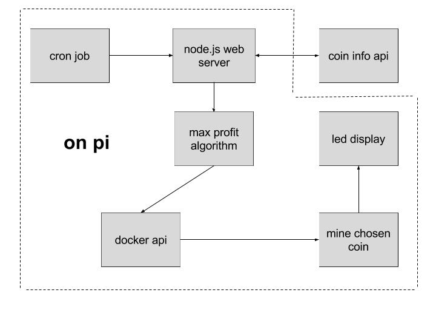

# April 27

* Email Task
  * use socket to retrieve IP address
  * use pythons smtp server to send mail
  * new email is cryptoraspberrypi@gmail.com
  * send on boot from `/etc/rc.local`
  * Final file in `tasks/ip_address_email.py`

### Craig's Arrival 
* downloaded MINGW64
* generated ssh key and added to github
* realized to had to run MINGW64 as administrator to use git clone
* raelized didn't have emacs, had to use this vi editor 
* edited this post from desktop computer

### Project planning
* schematic of services
* checked docker images of each coin
* lcd display may force us to use python and not node.js or ruby 

